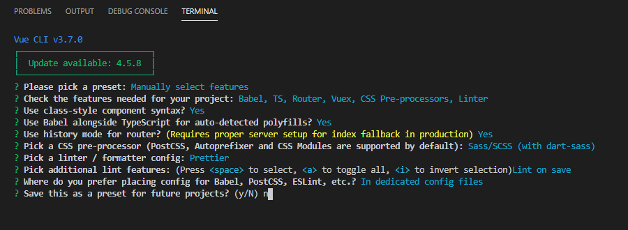
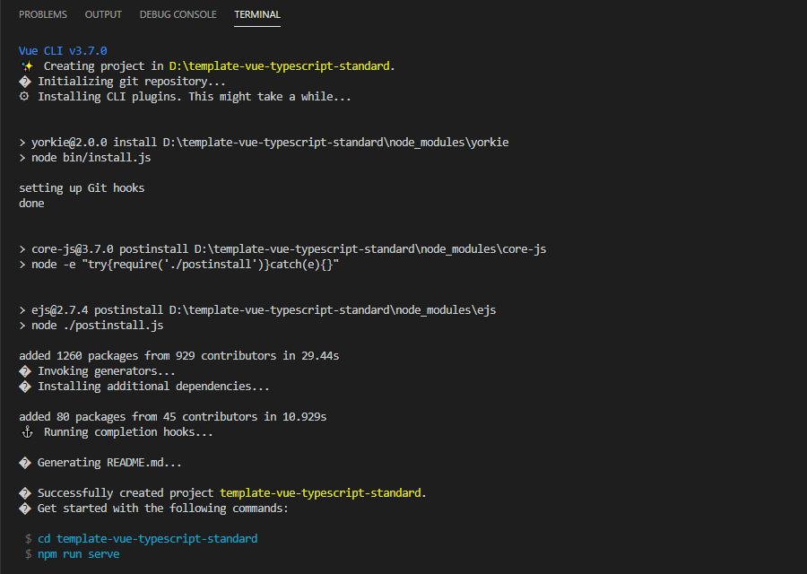

# vue + ts 代码规范

## 项目搭建





## 目录结构

```
template-vue-typescript-standard
├─ public
│  ├─ favicon.ico
│  └─ index.html
├─ screenshot
│  ├─ 创建完成.PNG
│  └─ 创建项目.PNG
├─ src
│  ├─ api
│  │  └─ users.ts
│  ├─ assets
│  │  ├─ iconfont
│  │  │  ├─ demo.css
│  │  │  ├─ demo_index.html
│  │  │  ├─ icon.css
│  │  │  ├─ iconfont.css
│  │  │  ├─ iconfont.eot
│  │  │  ├─ iconfont.js
│  │  │  ├─ iconfont.json
│  │  │  ├─ iconfont.svg
│  │  │  ├─ iconfont.ttf
│  │  │  ├─ iconfont.woff
│  │  │  └─ iconfont.woff2
│  │  └─ logo.png
│  ├─ components
│  │  └─ pagination
│  │     └─ index.vue
│  ├─ entity
│  │  ├─ page.ts
│  │  └─ user.ts
│  ├─ module-user
│  │  ├─ components
│  │  │  ├─ module-footer
│  │  │  │  ├─ index.scss
│  │  │  │  └─ index.vue
│  │  │  └─ module-header
│  │  │     ├─ index.scss
│  │  │     └─ index.vue
│  │  ├─ pages
│  │  │  ├─ user
│  │  │  │  ├─ components
│  │  │  │  │  ├─ user-add-dialog.vue
│  │  │  │  │  ├─ user-detail-dialog.vue
│  │  │  │  │  └─ user-edit-dialog.vue
│  │  │  │  └─ index.vue
│  │  │  └─ layout.vue
│  │  ├─ router
│  │  │  └─ index.ts
│  │  └─ index.ts
│  ├─ router
│  │  └─ index.ts
│  ├─ scss
│  │  └─ element-ui
│  │     ├─ el-button.scss
│  │     ├─ el-input.scss
│  │     └─ element-variables.scss
│  ├─ store
│  │  └─ index.ts
│  ├─ utils
│  │  ├─ cookies.ts
│  │  ├─ mixins.vue
│  │  ├─ request.ts
│  │  └─ scroll-to.ts
│  ├─ App.vue
│  ├─ main.ts
│  ├─ shims-tsx.d.ts
│  └─ shims-vue.d.ts
├─ babel.config.js
├─ package-lock.json
├─ package.json
├─ README.md
├─ tsconfig.json
└─ vue.config.js
```

## Project setup

```
npm install
```

### Compiles and hot-reloads for development

```
npm run serve
```

### Compiles and minifies for production

```
npm run build
```

### Run your tests

```
npm run test
```

### Lints and fixes files

```
npm run lint
```

### Customize configuration

See [Configuration Reference](https://cli.vuejs.org/config/).
